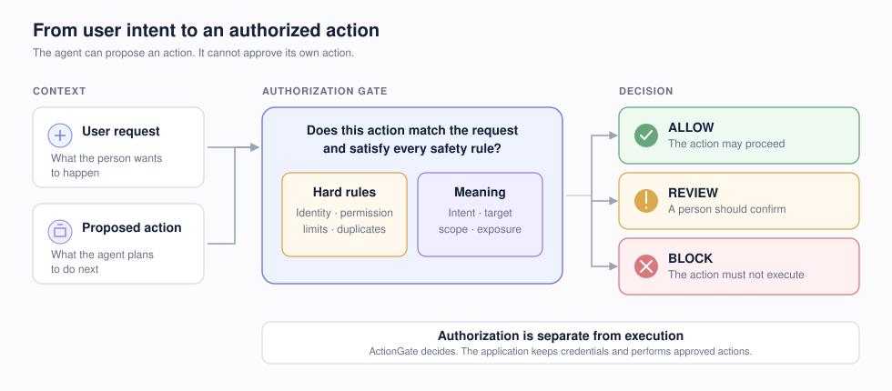
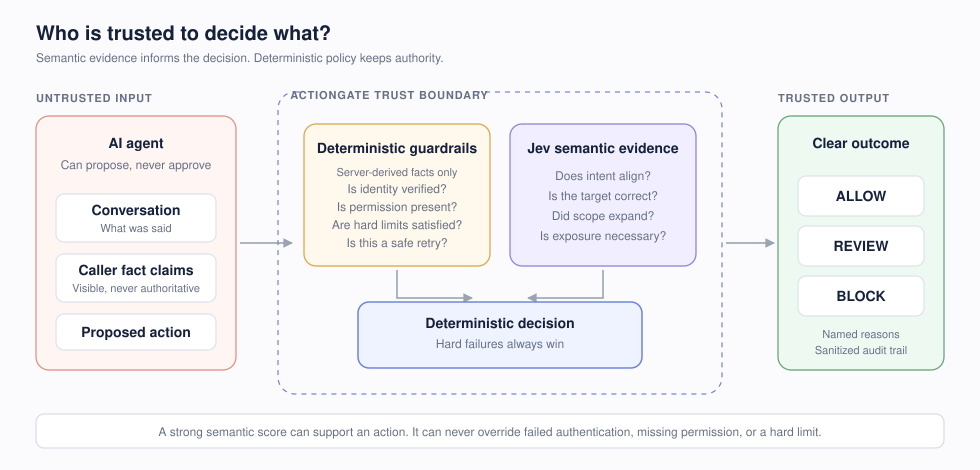

<p align="center">
  
</p>

# ActionGate

**Open-source runtime authorization for AI agents, powered by deterministic policy and [TypeSafe Jev](https://docs.typesafe.ai/concepts/system-one) through [OpenRouter](https://openrouter.ai/typesafe/jev-1.13).** ActionGate evaluates a proposed tool call before it creates a side effect and returns `ALLOW`, `REVIEW`, or `BLOCK` with an auditable, deterministic reason.

[](https://github.com/omkarghugarkar007/actiongate-jev/actions/workflows/ci.yml)
[](LICENSE)
[](package.json)
[](tsconfig.json)
[](https://openrouter.ai/typesafe/jev-1.13)
[](https://github.com/omkarghugarkar007/actiongate-jev/stargazers)

> **Early public MVP:** use mock or sandbox tools. ActionGate decides; your application owns execution and credentials. See the [security boundary](docs/threat-model.md) before production use.

## Why ActionGate?

AI agents increasingly send emails, issue refunds, mutate databases, and run shell commands. Schema validation can prove that a tool call is well-formed, but it cannot prove that the action matches what the user actually intended.

<p align="center">
  
</p>

ActionGate combines both kinds of control:

| Code decides | TypeSafe Jev supplies semantic evidence |
|---|---|
| Authentication and RBAC | Does this action match the explicit request? |
| Amounts, dates, limits, and exact comparisons | Is the chosen recipient or resource the intended one? |
| Tool schemas and server-owned risk classes | Does the action expand beyond the requested scope? |
| Idempotency, duplicates, and rate limits | Is sensitive information exposed unnecessarily? |

**Jev supplies evidence. Code owns authority.** A positive model score never overrides a deterministic security failure.

## Five-minute quick start

Requirements: Node.js 22+ and pnpm 10+.

```bash
git clone https://github.com/omkarghugarkar007/actiongate-jev.git
cd actiongate-jev
corepack enable
cp .env.example .env
pnpm install
pnpm dev
```

No model key is required for the default local experience. ActionGate starts with its deterministic fake provider so you can explore without spending credits.

- Dashboard: [http://localhost:3000](http://localhost:3000)
- API: [http://localhost:8080](http://localhost:8080)
- Health: [http://localhost:8080/health](http://localhost:8080/health)

Run the sandbox refund example in another terminal:

```bash
pnpm refund:demo
```

The demo cannot move real money. For REST, SDK, and deployment examples, follow the [integration guide](docs/integration-guide.md).

## Protect an agent tool

```ts
import { ActionGate } from "@actiongate/sdk";

const gate = new ActionGate({
  apiKey: process.env.ACTIONGATE_API_KEY!,
  baseUrl: process.env.ACTIONGATE_URL!
});

const result = await gate.authorize({
  requestId: crypto.randomUUID(),
  idempotencyKey: crypto.randomUUID(),
  tenantId: "acme",
  environment: "production",
  mode: "enforce",
  actor: { agentId: "support-agent" },
  userIntent: {
    text: "Refund the duplicate $49 charge.",
    source: "user_message"
  },
  proposedAction: {
    tool: "refund_payment",
    operation: "refund",
    arguments: { transactionId: "txn_8923", amountCents: 4900 },
    riskClass: "FINANCIAL"
  },
  deterministicFacts: {
    authenticated: true,
    authorizedByRbac: true,
    amountCents: 4900,
    currency: "USD"
  }
});

if (result.decision !== "ALLOW") {
  throw new Error(`ActionGate: ${result.decision}`);
}

// ActionGate never executes the customer tool.
await refundPayment("txn_8923", 4900);
```

Changing the amount to `49000` produces:

```text
BLOCK — AMOUNT_EXCEEDS_LIMIT
```

Proposing a refund when the user only asked “Why was I charged twice?” produces:

```text
REVIEW — MISSING_SEMANTIC_AUTHORIZATION
```

That is why agent authorization needs both deterministic code and semantic evidence.

## How it works

<p align="center">
  
</p>

ActionGate asks all six narrow Jev questions in one request: alignment, target match, policy conflict, sensitive-data exposure, scope expansion, and missing intent. It never asks one vague “is this safe?” question and never uses generated prose as an authorization reason.

Read the [architecture](docs/architecture.md), [threat model](docs/threat-model.md), and [engineering plan](docs/engineering-plan.md) for the complete design.

## TypeSafe Jev through OpenRouter

Enable the live provider server-side:

```env
DECISION_PROVIDER=openrouter
OPENROUTER_API_KEY=sk-or-v1-...
JEV_MODEL=typesafe/jev-1.13
```

The production model is pinned to `typesafe/jev-1.13`; ActionGate does not silently fall back to a general LLM. Verify the live Decisions API contract with:

```bash
pnpm jev:smoke
RUN_LIVE_JEV_TESTS=true pnpm test:jev:live
```

The smoke test validates the structured response, reports latency and resolved model/provider metadata, and writes a credential-free fixture to [`fixtures/openrouter`](fixtures/openrouter/).

### Cost tracking

Every live decision records provider-reported input tokens, output tokens, and USD cost. The dashboard aggregates decision spend. To compare cumulative OpenRouter usage with your previous local snapshot:

```bash
pnpm cost:track
```

The snapshot stays in the gitignored `.actiongate/` directory. Pricing is never hard-coded into authorization logic.

## Built for safe rollout

- **Shadow Mode** — observe `wouldHaveDecision` without interrupting tool execution.
- **Risk-aware failures** — financial, destructive, and credential actions fail closed when Jev is unavailable.
- **Deterministic precedence** — model probabilities cannot average away an RBAC, schema, or limit failure.
- **Server-owned risk** — agents cannot self-declare a safer risk class.
- **Minimal state** — only relevant fields are sent to the semantic provider.
- **Strict provider contracts** — malformed or incomplete Jev responses are rejected.
- **Auditable reasons** — reason text comes from named rules and signals, not model prose.
- **Replay protection** — identical idempotency retries return the original decision; changed payloads conflict.
- **Evaluation tooling** — versioned thresholds, a reproducible 500-case starter dataset, and safety-focused metrics.

## Common use cases

- Customer-support agents issuing refunds or credits
- Voice agents changing bookings
- Sales agents sending external email
- Operations agents editing CRM records
- Finance agents proposing accounting actions
- Coding agents writing files, deleting resources, or pushing Git changes
- MCP gateways and tool-execution proxies

## Repository structure

```text
apps/
  api/                    Fastify authorization API
  web/                    Next.js audit dashboard
packages/
  core/                   Contracts, hard rules, state, thresholds, composition
  decision-provider/      OpenRouter Jev and deterministic fake providers
  sdk-js/                 TypeScript client and tool wrapper
  db/                     Drizzle schema and PostgreSQL migrations
  evals/                  500-case dataset and evaluation CLI
examples/
  curl/                   Copy-paste REST authorization request
  refund-agent/           Safe, in-memory end-to-end example
fixtures/openrouter/      Sanitized live Jev contract fixtures
infra/                    Docker Compose and k6 profiles
docs/                     Integration, architecture, and threat model
```

## API surface

| Method | Path | Purpose |
|---|---|---|
| `POST` | `/v1/authorize` | Evaluate a proposed action |
| `GET` | `/v1/decisions` | List sanitized audit decisions |
| `GET` | `/v1/decisions/:id` | Inspect one decision and its signals |
| `GET` | `/v1/policies` | List immutable policy versions |
| `POST` | `/v1/policies/:id/versions` | Create a policy version |
| `POST` | `/v1/decisions/:id/override` | Record a human correction |
| `GET` | `/health` | Liveness |
| `GET` | `/ready` | Readiness |

See [integration-guide.md](docs/integration-guide.md) for request/response examples and failure handling.

## Development and verification

```bash
pnpm lint
pnpm typecheck
pnpm test
pnpm test:integration
pnpm build
pnpm e2e
pnpm audit --prod
```

Local infrastructure:

```bash
docker compose -f infra/docker-compose.yml up -d postgres redis
pnpm db:migrate
```

The repository includes unit, provider-contract, API integration, browser E2E, live Jev, migration, load, and adversarial test paths. The 500-case default evaluation is a **label-baseline integrity run**, not a claim of model accuracy; production thresholds require provider-backed calibration on representative data.

## Project status and roadmap

ActionGate is an independent community project and is not affiliated with or endorsed by TypeSafe AI or OpenRouter. TypeSafe, Jev, and OpenRouter are names of their respective owners.

The current API defaults to in-memory decision and policy repositories for a zero-dependency demo. PostgreSQL migrations and Redis infrastructure are included; production storage adapters, hashed tenant keys, OpenTelemetry exporters, and a credential-enforcing execution proxy are tracked in the [roadmap](docs/roadmap.md).

## Contributing

Ideas, integrations, policy examples, adversarial cases, and provider feedback are welcome. Read the [contribution guide](.github/CONTRIBUTING.md), browse [good first issues](https://github.com/omkarghugarkar007/actiongate-jev/labels/good%20first%20issue), or start a [discussion](https://github.com/omkarghugarkar007/actiongate-jev/discussions).

If ActionGate helps you build safer AI agents, **star the repository**—it helps other developers searching for TypeSafe Jev and AI-agent authorization discover the project.

Security reports should follow the [security policy](.github/SECURITY.md), not public issues.

## License

Apache License 2.0. See [LICENSE](LICENSE).
