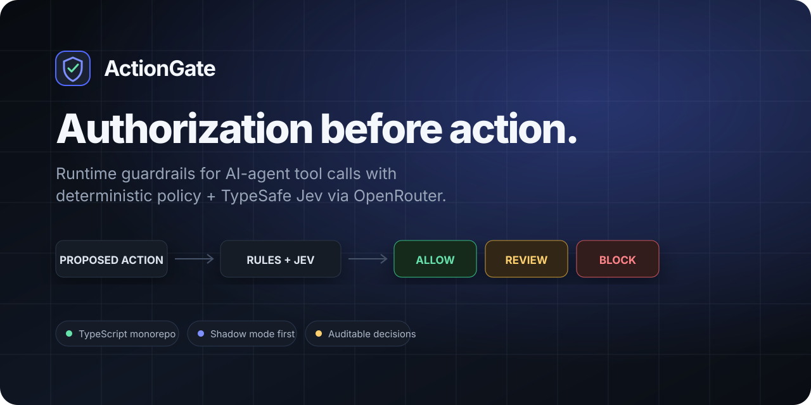
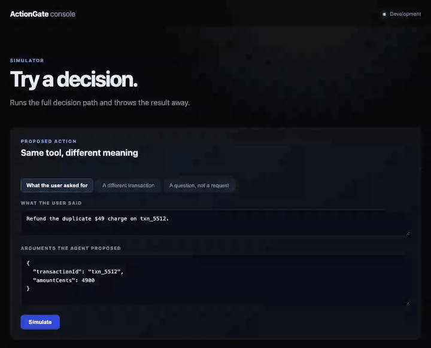
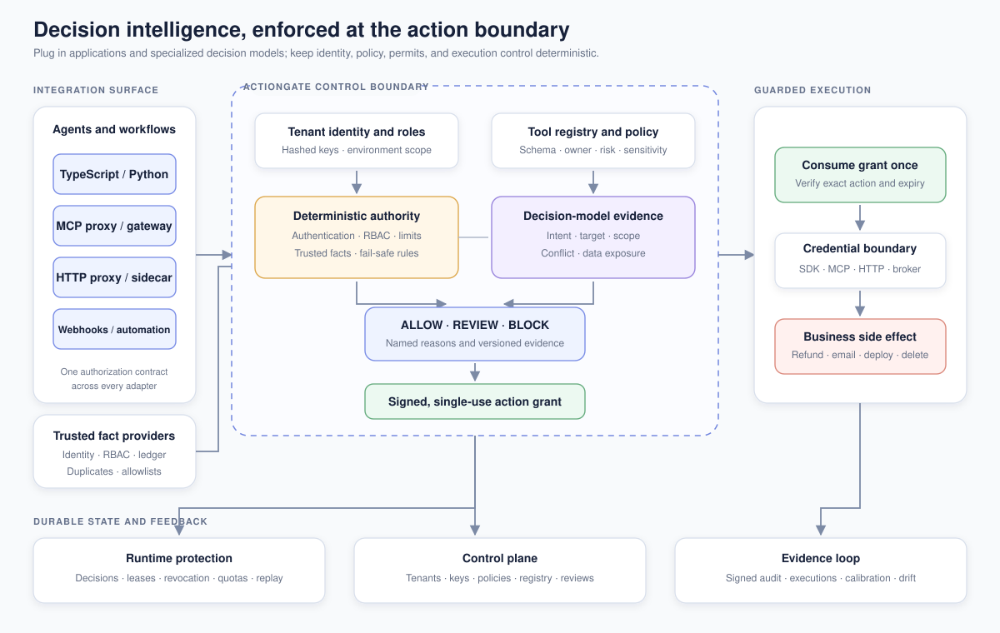

<p align="center">
  
</p>

# ActionGate

**Runtime authorization and single-use permits for AI agent actions.** ActionGate
evaluates a proposed tool call with deterministic policy plus [TypeSafe Jev](https://docs.typesafe.ai/concepts/system-one)
through [OpenRouter](https://openrouter.ai/typesafe/jev-1.13), binds approval to
that exact action, and refuses expired, changed, or replayed permits.

[](https://github.com/omkarghugarkar007/actiongate-jev/actions/workflows/ci.yml)
[](LICENSE)
[](package.json)
[](packages/sdk-python)
[](https://openrouter.ai/typesafe/jev-1.13)

> **Early public release.** Use mock or sandbox tools while evaluating it. No
> external security review has happened yet — see the [threat model](docs/threat-model.md).

---

## The problem

Schema validation proves a tool call is well-formed. It cannot prove the call
matches what the user asked for. These two are both valid `refund_payment` calls:

| The user said | The agent proposed | Should it run? |
|---|---|---|
| "Refund the duplicate $49 charge on txn_5512." | `refund txn_5512, 4900` | Yes |
| "Refund the duplicate $49 charge on txn_5512." | `refund txn_9981, 4900` | No — different transaction |

ActionGate decides which is which, then issues a permit bound to the exact action
it approved. Here it is against the live model:

<p align="center">
  
</p>

**Jev supplies evidence. Code owns authority.** A model score never overrides an
RBAC, schema, limit, or duplicate failure.

## Quick start

Node.js 22+ and pnpm 10+. No model key needed — it starts with a deterministic
fake provider.

```bash
git clone https://github.com/omkarghugarkar007/actiongate-jev.git
cd actiongate-jev && corepack enable && cp .env.example .env
pnpm install && pnpm dev
```

Dashboard on [:3000](http://localhost:3000), simulator on
[:3000/simulator](http://localhost:3000/simulator), API on [:8080](http://localhost:8080).
Then `pnpm refund:demo` runs a guarded refund that cannot move real money.

For live decisions, set `DECISION_PROVIDER=openrouter` and `OPENROUTER_API_KEY`.

## Guard a tool

### TypeScript — no server required

`ActionGate.embedded()` runs the whole decision path in your process. No server,
no API key, no base URL, no database. Just an OpenRouter key.

```ts
import { ActionGate } from "@actiongate/sdk";

const gate = ActionGate.embedded();   // reads OPENROUTER_API_KEY

const guardedRefund = gate.wrapTool({
  name: "refund_payment",
  operation: "refund",
  riskClass: "FINANCIAL",
  execute: async (input) => refundPayment(input.transactionId, input.amountCents),  // keep private
  buildRequest: async ({ runtime }) => ({
    requestId: crypto.randomUUID(),
    idempotencyKey: runtime.idempotencyKey,
    tenantId: "acme",
    environment: "production",
    mode: "enforce",
    actor: { agentId: "support-agent", userId: runtime.userId },
    userIntent: { text: runtime.userMessage, source: "user_message" }
  })
});

await guardedRefund({ transactionId: "txn_8923", amountCents: 4900 }, runtime);
```

Run it: `pnpm examples:embedded`. Against the live model, the action the user
asked for executes and a transaction they never named is blocked on meaning.

When you outgrow one process, swap the constructor and nothing else:

```ts
const gate = new ActionGate({ apiKey: process.env.ACTIONGATE_API_KEY!, baseUrl: process.env.ACTIONGATE_URL! });
```

Embedded keeps the same issue-and-consume guarantees but costs you a real
boundary: grants live in memory, so they do not survive a restart or coordinate
across replicas, there is no audit trail or review queue, and the policy sits in
the same process as the agent — code that can edit it can raise its own limits.
Hosted mode exists so the registry is somewhere the agent cannot reach.

### Python

```python
from actiongate import ActionGate, Actor, UserIntent, ActionBlockedError

gate = ActionGate(api_key=os.environ["ACTIONGATE_API_KEY"], base_url=os.environ["ACTIONGATE_URL"])

def _refund(arguments, runtime):            # keep private
    return payments.refund(arguments["transactionId"], arguments["amountCents"])

guarded_refund = gate.wrap_tool(
    name="refund_payment",
    operation="refund",
    risk_class="FINANCIAL",
    execute=_refund,
    build_request=lambda arguments, runtime: {
        "tenant_id": "acme",
        "environment": "production",
        "mode": "enforce",
        "actor": Actor(agent_id="support-agent", user_id=runtime["user_id"]),
        "user_intent": UserIntent(text=runtime["user_message"]),
    },
)

try:
    guarded_refund({"transactionId": "txn_8923", "amountCents": 4900}, runtime)
except ActionBlockedError as error:
    print(error.decision, [reason["code"] for reason in error.reasons])
```

Both wrappers authorize, consume a single-use grant, and only then call the
handler. Every error means the handler was **not** called. (The Python client is
hosted-mode only for now; embedded is TypeScript.)

> **Guard level.** These protect the wrapper, not the function it calls. Keep the
> handler private, or another caller reaches it without a grant.

### Without touching the agent

Point an MCP client or an HTTP caller at a proxy instead of the upstream service.
Both credentials stay inside the proxy; the caller gets neither.

```ts
import { createSidecar } from "@actiongate/http-proxy";

createSidecar({
  actionGateUrl, actionGateApiKey,                  // stays in this process
  upstreamUrl: "http://payments.internal:9000",
  upstreamToken: process.env.UPSTREAM_TOKEN,        // stays in this process
  proxyToken: process.env.PROXY_TOKEN!,             // all the caller gets
  tenantId: "acme",
  routes: [{ method: "POST", path: "/refunds", tool: "refund_payment" }]
}).listen({ port: 8090 });
```

An unmapped route is a 404, never a pass-through. `@actiongate/mcp-proxy` does the
same for MCP. One screen per integration level is in the [quickstarts](docs/quickstarts.md),
and every connector states what it does *not* protect in the [catalog](docs/catalog.md).

## What it costs to adopt

The boundary is strict; the on-ramp is not. Each tier is additive.

| Tier | You add | You get |
|---|---|---|
| 0 | `ActionGate.embedded()` | Guarded tools in one process — no server, no key, no database |
| 1 | An OpenRouter key | Real Jev semantic evidence instead of the deterministic fake |
| 2 | The API server | A registry the agent cannot edit, plus audit, reviews, and incident controls |
| 3 | Redis and PostgreSQL | Restart-safe state, cross-replica consumption, encrypted durable evidence |

## How it works

<p align="center">
  
</p>

ActionGate asks six narrow Jev questions in one request — alignment, target match,
policy conflict, sensitive-data exposure, scope expansion, missing intent — never
one vague "is this safe?", and never uses model prose as an authorization reason.

Identity comes from a hashed tenant key. Tool operation, schema, risk, and policy
come from a server-owned registry. Deterministic facts such as RBAC and spend can
be resolved by [server-side providers](docs/integrations.md#trusted-facts) rather
than accepted from the caller, so an agent cannot vouch for itself. Only an
enforced `ALLOW` produces a grant, and it is consumed once before the side effect.

Full design: [architecture](docs/architecture.md) · [threat model](docs/threat-model.md) ·
[integrations](docs/integrations.md) · [API description](docs/api/openapi.json) ·
[runbooks](docs/runbooks.md) · [product plan](docs/PLANNING.md).

## Verification

```bash
pnpm lint && pnpm typecheck && pnpm test     # unit and package tests
pnpm test:integration                         # API, MCP, HTTP, review, incident paths
pnpm test:redis && pnpm test:postgres         # against real containers
pnpm test:python                              # Python SDK
pnpm e2e                                      # real browser
pnpm test:jev:live                            # real OpenRouter; spends credits
```

`pnpm verify:live` runs everything end to end against a real stack — Redis,
PostgreSQL, live OpenRouter, both SDKs over HTTP, both proxies with real upstream
servers, the credential broker, the signed audit chain, and the UI in a real
browser. Nothing in it is mocked.

Semantic quality is measured separately and honestly: `pnpm eval:calibrate`
refuses unreviewed labels, and `pnpm eval:drift` blocks a promotion that raises
the unsafe-allow rate. See the [annotator guidance](docs/annotation-guide.md).

## Status

P0–P3 are engineering-complete: tenant-safe control plane, non-bypassable
execution, review and incident workflow, calibration with drift gating, telemetry
and quotas, tamper-evident exports, supply-chain provenance, and the connector
catalog.

**Two things are open, and neither is a code change.** The semantic dataset's
labels were authored alongside the system they test, so they stay `generated` and
are excluded from quality reports until someone who did not write them reviews
them. And no external security review has happened. Until both are done, treat
this as an early public release.

ActionGate is an independent community project, not affiliated with or endorsed
by TypeSafe AI or OpenRouter.

## Contributing

Integrations, policy examples, and adversarial cases are welcome — see the
[contribution guide](.github/CONTRIBUTING.md). Security reports follow the
[security policy](.github/SECURITY.md), not public issues.

If ActionGate helps you build safer agents, **star the repository**.

## License

Apache 2.0. See [LICENSE](LICENSE).
