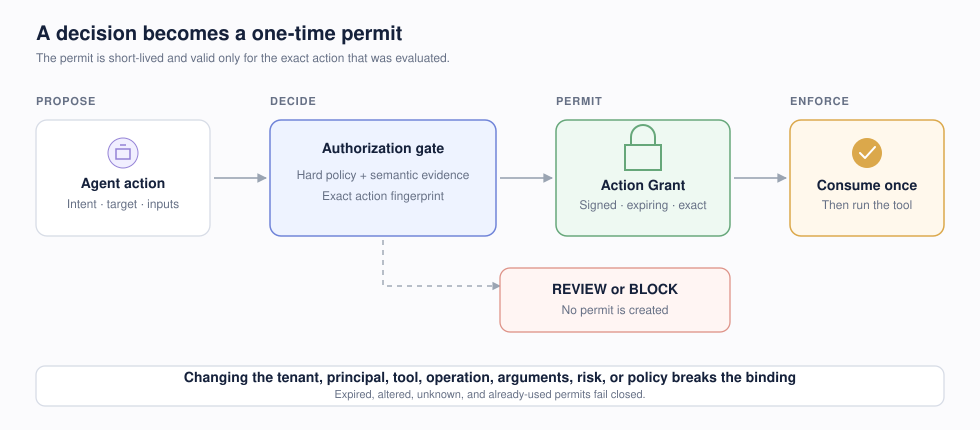

# Architecture

ActionGate separates semantic evidence, authorization, and enforcement. The caller provides user intent, a proposed tool call, narrowly selected context, and deterministic facts. The service validates the envelope, verifies the server-owned tool policy, applies hard rules, asks the configured semantic provider one batch of narrow questions, and composes a final outcome with fixed precedence.

An enforced `ALLOW` becomes a signed, expiring Action Grant. That grant is bound to the exact tenant, environment, agent, optional user/session, tool, operation, canonical arguments, risk class, policy version, and decision. The executor must consume it once with the same action before the side effect runs. `REVIEW`, `BLOCK`, and shadow-mode outcomes never receive a grant.



```text
SDK → API auth → schema → idempotency → policy → deterministic rules
                                                  │
                                                  ├─ hard BLOCK
                                                  ▼
                                         minimal state builder
                                                  ▼
                                     DecisionProvider (Jev/fake)
                                                  ▼
                                     deterministic composition
                                                  ▼
                             decision + sanitized audit event
                                                  │
                                  enforced ALLOW only
                                                  ▼
                                  signed exact-action grant
                                                  ▼
                            one-time consume → guarded executor
```

Precedence is: hard deterministic block, critical semantic-hazard block, deterministic review, semantic uncertainty review, then allow. Shadow mode changes only the operational result; `wouldHaveDecision` retains the composed enforcement result.

## Seams

- `DecisionProvider` isolates OpenRouter's alpha Decisions API from core authorization logic.
- `DecisionRepository` isolates audit/idempotency storage.
- `GrantRepository` isolates issuance and atomic one-time consumption.
- immutable policy documents select a risk-specific threshold profile.
- state builders whitelist relevant resources rather than serializing arbitrary application context.
- raw grant tokens are returned only to the authorization caller and are not copied into decision audit records.
- tool execution remains outside the API; the SDK wrapper provides the current guarded execution boundary.

## Grant lifecycle

1. The engine creates and stores a grant only after an enforced `ALLOW`.
2. Idempotent authorization retries return the same decision and grant; they do not mint extra permits.
3. The consumer verifies the signature, version, time window, and exact action fingerprint.
4. The repository atomically marks the grant consumed.
5. A second consumer receives `GRANT_ALREADY_CONSUMED`.

Consumption is deliberately fail-closed. It provides at-most-once authorization, not exactly-once side effects: a process failure after consumption requires downstream reconciliation before requesting a new authorization.

## Current and target enforcement boundary

Today, the TypeScript wrapper consumes a grant immediately before it invokes the supplied function. This prevents accidental execution after a failed decision and blocks mutation or replay inside the integration. It cannot stop code that possesses a downstream credential from bypassing the wrapper entirely.

The target boundary is a gateway or credential broker where the tool is not directly reachable without a valid grant. Durable PostgreSQL grant state and transactional cross-instance consumption are required before multi-instance production. See the [product plan](PLANNING.md) for the ordered milestones and release gates.
